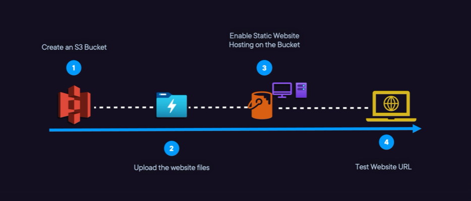

# Deploying an S3 Static Website Using AWS CLI

## 📌 Overview
This guide details how to set up a **static website** on Amazon S3 using AWS CLI. The process includes:
- Creating an **IAM user** with full access to S3.
- Setting up an **S3 bucket** and enabling it for static website hosting.
- Uploading an `index.html` file.
- Applying a **bucket policy** to allow public access to the file.
- Testing access with `curl`.

---
## 🏗️ Architecture



### 📝 **Steps Overview**
1. **Create IAM User (`toto`)** with full access to S3.
2. **Create an S3 Bucket** named `toto123456789`.
3. **Upload `index.html`** to the bucket.
4. **Apply Public Read Policy** to serve the website.
5. **Test Access** using `curl`.

---

## 🔧 **Step-by-Step Guide**

### **1️⃣ Create IAM User (`toto`) with Full S3 Access**
```bash
aws iam create-user --user-name toto
```

Attach an S3 full access policy:
```bash
aws iam attach-user-policy --user-name toto --policy-arn arn:aws:iam::aws:policy/AmazonS3FullAccess
```

### **2️⃣ Create S3 Bucket (`toto412345678`)**
```bash
aws s3api create-bucket --bucket toto412345678 --region us-east-1 --create-bucket-configuration LocationConstraint=us-east-1
```

### **3️⃣ Create and Upload `index.html`**
Create an HTML file:
```bash
echo "<html><body><h1>Welcome to My S3 Static Website</h1></body></html>" > index.html
```
Upload the file to S3:
```bash
aws s3 cp index.html s3://toto412345678/
```

### **4️⃣ Apply Public Access Policy (`policy.json`)**
Create a file `policy.json` with the following content:
```json
{
  "Version": "2012-10-17",
  "Statement": [
    {
      "Effect": "Allow",
      "Principal": "*",
      "Action": "s3:GetObject",
      "Resource": "arn:aws:s3:::toto412345678/*"
    }
  ]
}
```

Apply the policy:
```bash
aws s3api put-bucket-policy --bucket toto412345678 --policy file://policy.json
```

### **5️⃣ Enable Static Website Hosting**
```bash
aws s3 website s3://toto412345678/ --index-document index.html
```

### **6️⃣ Test Access with `curl`**
Find the S3 static website URL:
```bash
echo "http://toto412345678.s3-website-us-east-1.amazonaws.com"
```
Test with `curl`:
```bash
curl http://toto412345678.s3-website-us-east-1.amazonaws.com
```

---

## ✅ **Expected Output**
If everything is set up correctly, the `curl` command should return the HTML content:
```html
<html><body><h1>Welcome to My S3 Static Website</h1></body></html>
```

### 🎯 **Congratulations! Your static S3 website is live!** 🚀

---

## 🔒 **Security Considerations**
- Ensure you **do not expose sensitive data** in the public bucket.
- Limit IAM permissions when necessary.
- Use CloudFront for better security & performance.

---

## 📚 **References**
- [AWS CLI S3 Commands](https://docs.aws.amazon.com/cli/latest/reference/s3/)
- [AWS IAM Policies](https://docs.aws.amazon.com/IAM/latest/UserGuide/access_policies.html)
